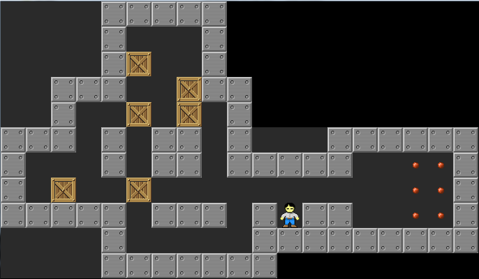
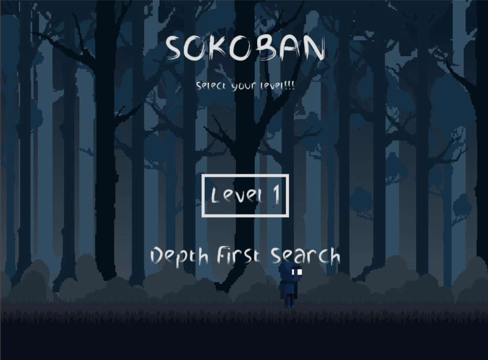
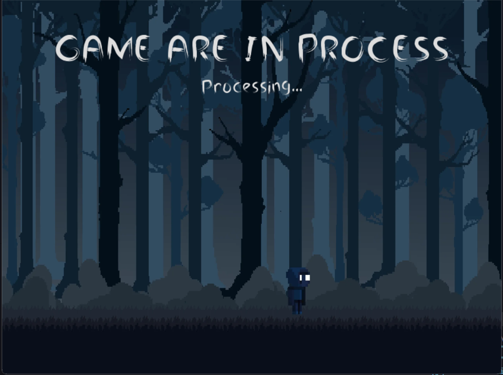
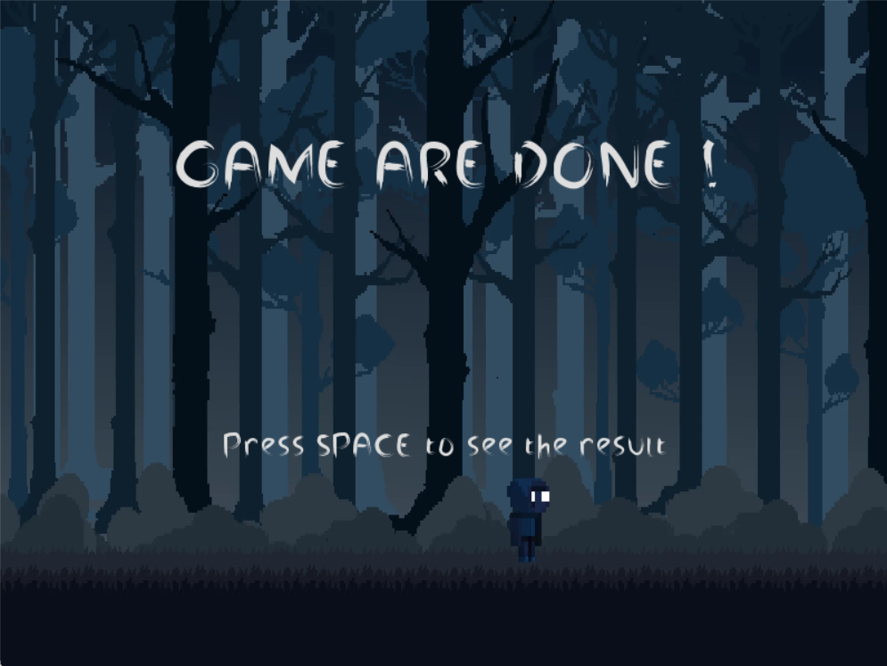
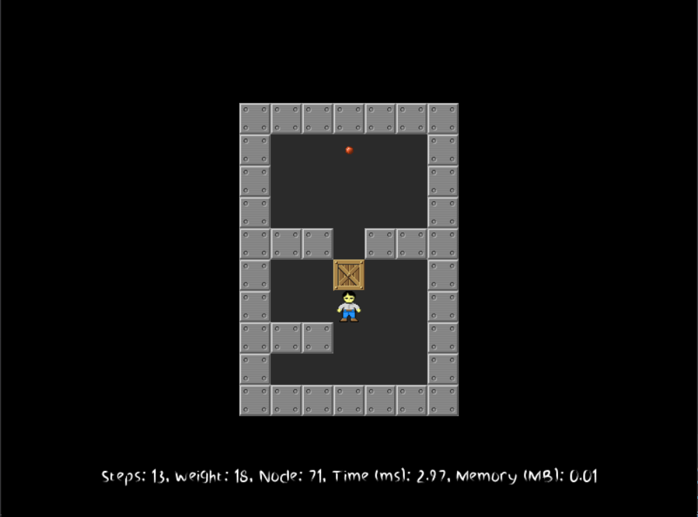

# SoKoBan Game

A Sokoban game created in Python using Pygame with AI pathfinding algorithms (DFS, BFS, UCS, A\*).

This project uses various search algorithms—Depth First Search (DFS), Breadth First Search (BFS), Uniform Cost Search (UCS), and A\*—to find solutions for each level. Players can select a level and the algorithm to solve the puzzle. The interface is built with Pygame, providing a fun and interactive experience for exploring pathfinding algorithms in action.

## SOKOBAN INTRODUCTION

Sokoban is a puzzle video game genre in which the player pushes crates or boxes around in a warehouse, trying to get them to some goal locations.The game is played on a board of squares, where each square is a floor or a wall. Some floor squares contain boxes, and some floor squares are marked as goal locations.

The player is confined to the board and may move horizontally or vertically onto empty squares (never through walls or boxes). The player can move a box by walking up to it and push it to the square in front. Boxes cannot be pulled, and they cannot be pushed to squares with walls or other boxes. The number of boxes equals the number of storage locations. The puzzle is solved when all boxes are placed at storage locations.

<div align="center">

</div>

## Authors

**Quach Thanh Kiet - Vo Ha Lam - Huynh Gia Khanh - Nguyen Tan Dong**

## Lasted Version

1.1.0

## Features

- Interactive GUI built with __Pygame__
- __AI Pathfinding Algorithms:__
  - Depth First Search (DFS)
  - Breadth First Search (BFS)
  - Uniform Cost Search (UCS)
  - A* Search (A*)
- Level selection and algorithm choice for solving levels
- Console-based testing for unit validation

## Requirements

- **Python 3.12** or higher
- **Pip 24.3.1** or higher

## Installation

__Install Dependencies__

```sh
$ pip install -r requirements.txt
```

## Usage

__Run [the game](#run-game) to experience the graphical interface, or execute the [algorithm](#run-test-algorithm) for a quick test of its functionality.__ 
 

### Run test algorithm

```sh
$ python runmain.py
```

This command will start the main script, `runmain.py`, to compare the effectiveness of different algorithms in solving mazes. Running this test helps you observe and analyze how each algorithm approaches maze-solving, highlighting their strengths and weaknesses in various scenarios.
**Purpose:**

- This command is specifically aimed at showcasing the _differences in efficiency_ and _problem-solving approaches_ among the algorithms.
- It allows you to see variations in _speed_, _path optimization_, and _computational resource_ usage for each algorithm.

The output will be created, <a href="output/"> here </a>

### Run game

#### Step 1: Launching the game

__Run the command below__

```sh
$ python main.py
```
Upon starting, you’ll see a main menu where you can:
+ Choose a _level_ (1 to 10).
+ Select an _AI algorithm_ for solving the level.

<div align="center">

</div>

#### Step 2: Selecting a level and Algorithm

_Use the arrow keys (__left__ or __right__) to choose a level between 1 and 10._

_Use the space bar to select an algorithm_
+ __DFS__ explores as far as possible along each branch before backtracking.
+ __BFS__ ensures the shortest solution in terms of moves but can be slower.
+ __UCS__ optimizes the total cost of moves.
+ __A*__ uses heuristics to find an efficient path.

#### Step 3: Start the game

Press __Enter__ to begin solving the level with the chosen algorithm. Observe the AI as it calculates the path to solve the puzzle.

<div align="center">

</div>

While the program is solving the puzzle (which may take approximately 1 to 5 minutes), you can cancel the process at any time by pressing the __ESC__ key.

Once the puzzle is solved, press __SPACE__ to view the completed result.
<div align="center">

</div>

#### Step 4: View the result

After completing __Step 3__(#step-3-start-the-game),the game will automatically display the solution.

<div align="center">

</div>

Once the puzzle is solved, the UI will return to the main menu. You can then go back to __Step 2__(#step-2-selecting-a-level-and-algorithm) to choose a new level and algorithm to try again.

## Reporting
+ __Video__(https://www.youtube.com/watch?v=fSL-BlK9NcY&feature=youtu.be)
+ __Report__(report.pdf) link này chưa biết do lúc làm chưa có


## References

### For UI and game logic
+ __[GUI](https://www.geeksforgeeks.org/pygame-tutorial/)__
+ __[Game Logic]__(https://sokoban.fandom.com/wiki/Sokoban_Wiki)
### For Algorithm
+ https://viblo.asia/p/data-structure-algorithm-graph-algorithms-breadth-first-search-bfs-gwd43kMM4X9
+ https://www.geeksforgeeks.org/problems/implementation-of-priority-queue-using-binary-heap/1?itm_source=geeksforgeeks&itm_medium=article&itm_campaign=practice_card
+ https://github.com/henry1599/Sokoban_AI_Solver_Basic